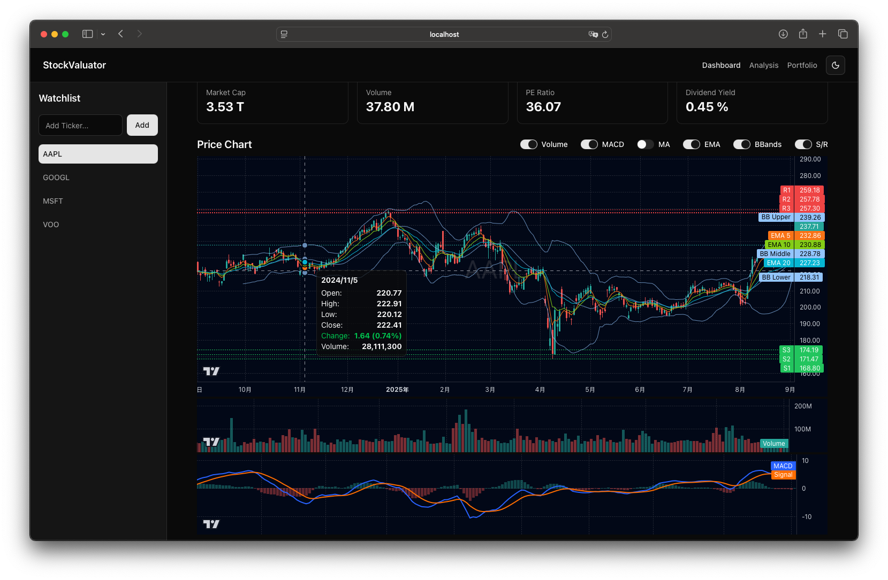
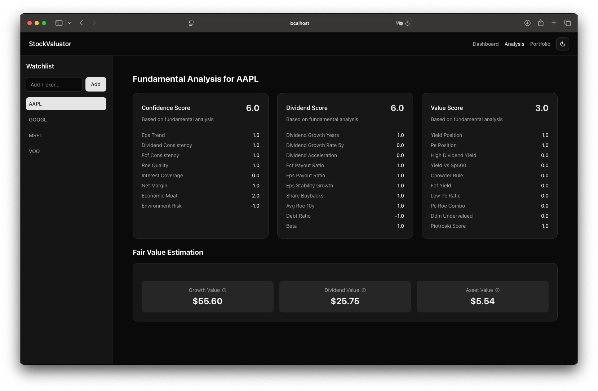
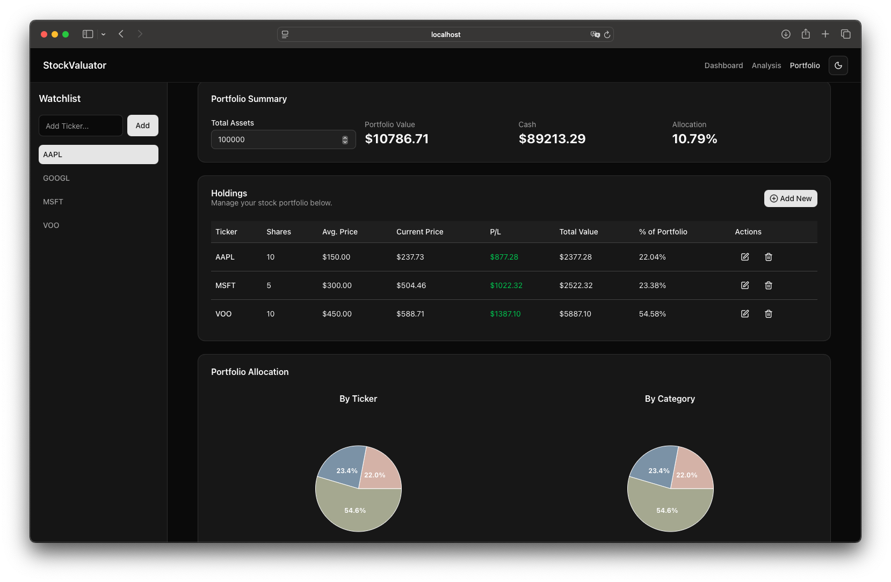

# StockValuator

A comprehensive, full-stack web application for the modern investor, focusing on deep value analysis while providing a full suite of technical analysis and portfolio management tools. This all-in-one platform helps users make informed decisions by estimating fair stock prices, analyzing market trends, and tracking personal asset allocation.

## Preview

| Dashboard | Analysis | Portfolio |
| :---: | :---: | :---: |
|  |  |  |

## Core Features

- **Advanced Value Investing Analysis**
  - **Confidence Score**: Evaluates long-term stability based on EPS, dividends, FCF, and ROE.
  - **Dividend Score**: Assesses the quality and sustainability of a company's dividend.
  - **Value Score**: Determines if a stock is undervalued based on various metrics like P/E, yield, and DDM.
  - **Fair Value Estimation**: Provides calculated estimates for a stock's fair value based on Growth, Dividend, or Asset models, with clear explanations for each calculation.

- **Comprehensive Technical Analysis Dashboard**
  - **Interactive Candlestick Chart**: A professional and theme-aware K-line chart for detailed price action analysis.
  - **Toggleable Indicators**: Full control over the chart's appearance with individual switches for:
    - Bollinger Bands
    - Moving Averages (MA)
    - Exponential Moving Averages (EMA)
    - Support & Resistance Levels
  - **Sub-Chart Indicators**: Dedicated chart panels for:
    - Volume
    - MACD (with histogram and signal lines)

- **ETF-Specific View**
  - When an ETF is selected, the analysis view adapts to show:
    - A detailed summary and key metrics (Expense Ratio, Yield, P/E, etc.) sourced from reliable APIs.
    - A visual breakdown of the Top 15 holdings in a pie chart and a detailed table.

- **Personalized Portfolio Management**
  - Track individual stock holdings with share count and average price.
  - Real-time profit/loss and total value calculation.
  - Manage total assets to see portfolio allocation vs. cash.
  - Visualize holdings by ticker and by investment category with interactive pie charts.

- **Modern UI/UX & Architecture**
  - **State-Driven Navigation**: A clean, tab-based UI to switch between Dashboard, Analysis, and Portfolio views.
  - **Data Aggregation**: Backend scrapers fetch data from multiple online financial sources, with source-de-identification via environment variables.
  - **Customizable Theme**: Light/Dark mode support, with a manual toggle and respect for system preference.

## Tech Stack

### Backend
- **Framework**: FastAPI
- **Web Scraping**: Playwright
- **Financial Data API**: yfinance
- **Data Analysis**: Pandas, NumPy, SciPy
- **Database**: PostgreSQL
- **Containerization**: Docker, Docker Compose

### Frontend
- **Framework**: Next.js (React)
- **State Management**: Zustand
- **UI**: Shadcn/UI, Radix UI, Tailwind CSS
- **Charting**: lightweight-charts, recharts
- **Language**: TypeScript

## Getting Started

Follow these instructions to get the project up and running on your local machine.

### Prerequisites

- Git
- Docker & Docker Compose
- Node.js & npm

### Installation & Setup

1.  **Clone the repository:**
    ```bash
    git clone https://github.com/RyanCCJ/StockValuator.git
    cd StockValuator
    ```

2.  **Configure Environment Variables:**
    - Create a `.env` file inside the `/backend` directory by copying the example file.
    - This file contains the URLs for the scrapers and the database connection string. The default values are generally suitable for local development.
    ```bash
    # This command works on Linux/macOS
    cp .env.example backend/.env
    ```

3.  **Build and Run the Application:**
    - This single command builds and runs all services (backend, frontend, db, etc.).
    ```bash
    docker-compose up --build -d
    ```
    - The **first time** you run the application, you need to install the Playwright browsers inside the backend container:
    ```bash
    docker-compose exec backend playwright install
    ```

4.  **Access the Application:**
    - **Frontend**: `http://localhost:3000`
    - **Backend API Docs**: `http://localhost:8000/docs`

## License

Distributed under the AGPL-3.0 License. See `LICENSE` for more information.