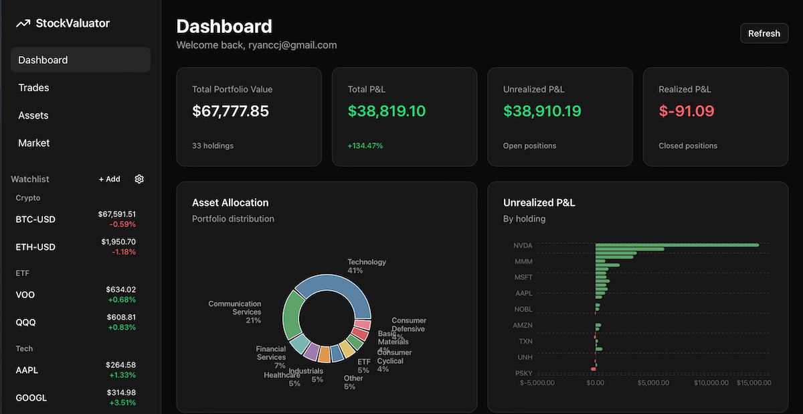
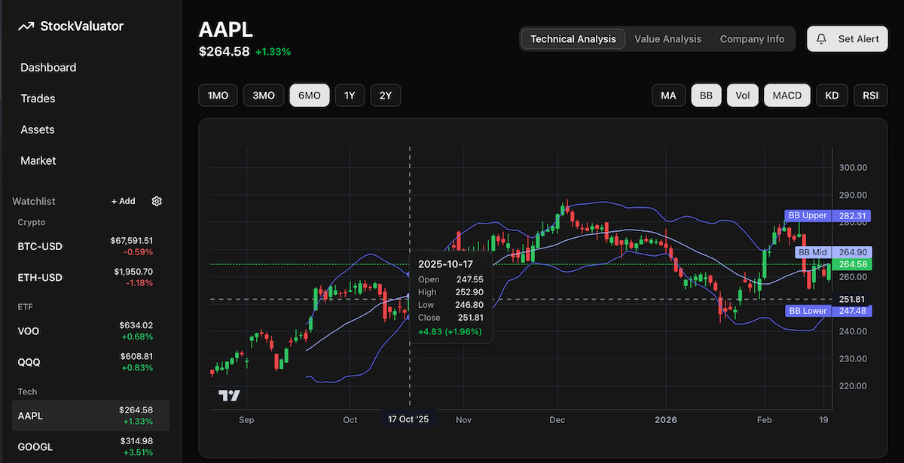
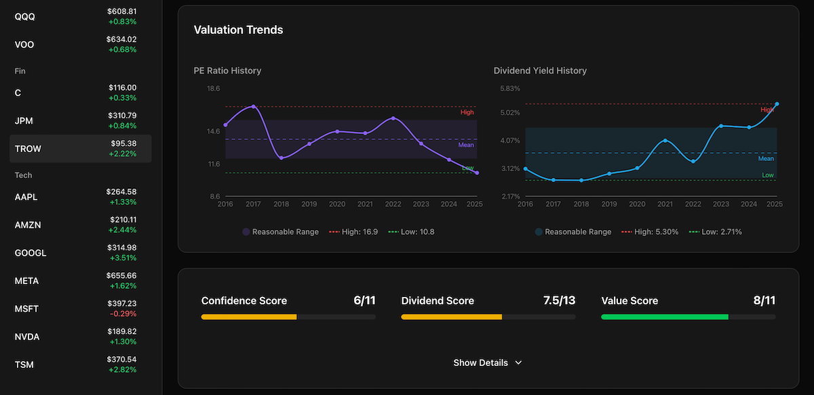
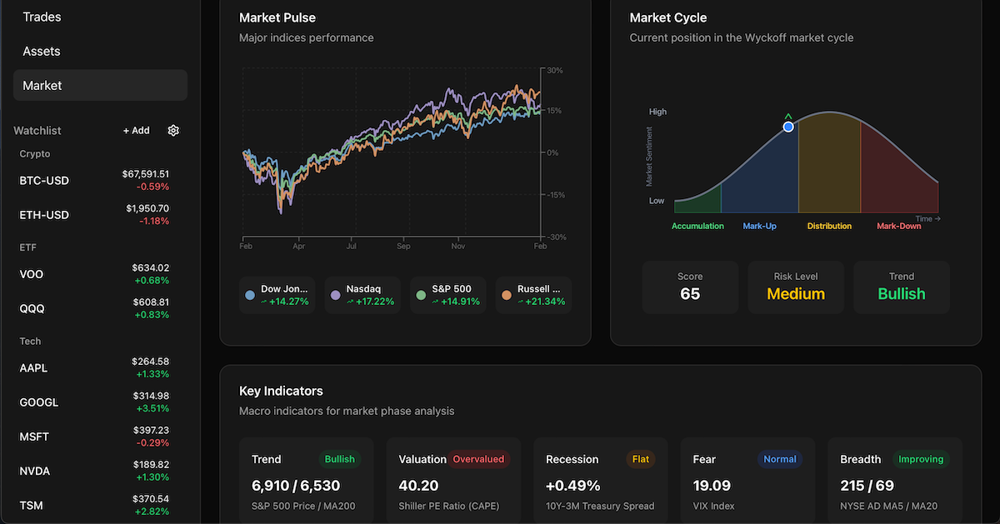

# StockValuator

<div align="center">


</div>

**StockValuator** is a comprehensive analysis dashboard designed for individual investors. It streamlines the process of value investing by integrating fundamental valuation models with modern technical charting tools in a single interface.

Unlike simple stock trackers, StockValuator helps users evaluate investment opportunities by consolidating financial data, calculating fair value estimates, and tracking market cycles.

## 📸 Preview

### Portfolio & Asset Management
*The central hub for tracking your investments. Features multiple specialized views including **Assets** for overall allocation, **Trades** for historical logging, and a **Broker Importer** for seamless data migration from platforms like Schwab.*


### Stock Analysis & Charting
*Professional-grade technical charts built with Lightweight Charts, featuring interactive indicators (e.g., MACD, RSI, Bollinger Bands, MA, and custom overlays).*


### Fundamental Valuation
*Calculated Fair Value estimates vs. Current Price, supported by 10-year historical metrics and algorithmic confidence scores.*


### Market Cycle Indicator
*Macro-economic analysis combining Shiller PE, Treasury Yield Spreads, and Market Breadth to assess overall market risk levels.*


## ✨ Key Features

- **Portfolio & Trade Management**
  - **Comprehensive Dashboard**: Real-time overview of total portfolio value, unrealized P/L, and unified asset tracking.
  - **Broker Data Import**: Seamlessly migrate historical trade data from major platforms (e.g., Charles Schwab).
  - **Investment Journaling**: Record detailed psychological notes for every trade to refine long-term discipline.
  - **Visual Portfolio Analytics**: Dynamic sector distribution and holding-specific performance.
  - **Smart Price Alerts**: Set custom price targets with automated **Email Notifications** via Gmail API (OAuth 2.0) or SMTP.

- **Advanced Charting**
  - **High-Performance Interactivity**: Built with **TradingView Lightweight Charts** for smooth price action and data visualization.
  - **Technical Analysis**: Integrated indicators including **MA, Bollinger Bands, MACD, RSI, and KD**.
  - **Multi-Panel Views**: Synchronized sub-charts for volume and oscillator analysis.
  - **ETF Insights**: Dedicated views for ETF expense ratios, yields, and top holdings distribution.

- **Intelligent Value Scoring**
  - **AI-Assisted Qualitative Scoring**: Optional LLM integration (OpenAI, Anthropic, Gemini) to automatically evaluate Moat and Risk based on historical data and reasoning.
  - **Confidence Score**: Algorithmic assessment of 10+ years of financial consistency (EPS, ROE, FCF).
  - **Dividend Safety**: Analysis of payout ratios and yield sustainability.
  - **Fair Value Models**: Automated calculation using:
    - *Growth-Based Model (Lynch Ratio)*
    - *Dividend Valuation (Target Yield Model)*
    - *Asset-Based Valuation (Tangible Book)*

- **Macro Market Analysis**
  - **Market Cycle Indicator**: A composite score (0-100) that identifies the current market stage: **Accumulation, Mark-Up, Distribution, or Mark-Down**.
  - **Data Aggregation**: Combines Shiller PE, Treasury Yield Spreads, VIX, and Market Breadth to assess systemic risk and investment opportunities.

- **Internationalization (i18n)**
  - Full support for **English** and **Traditional Chinese (正體中文)**.

## 🏗️ Architecture & Tech Stack

StockValuator is built as a robust, containerized micro-service application.

| Component | Technology | Description |
|-----------|------------|-------------|
| **Frontend** | Next.js 16, TypeScript | Server-side rendering, Client-side interactivity with Zustand. |
| **Backend** | FastAPI, Python 3.12 | High-performance async API. |
| **Task Queue** | Celery, Redis | Distributed background worker and scheduled task management. |
| **Database** | PostgreSQL | Relational storage for historical financial data. |
| **Caching** | Redis | Caching API responses and distributed locking. |
| **Scraping** | Playwright | Headless browser automation for complex data sources. |

### Technical Highlights
- **Browser Pool**: Custom implementation to manage memory-heavy headless browsers, preventing leaks and ensuring server stability. [Read more](docs/BROWSER_POOL.md).
- **Distributed Locking**: Redis-based locking prevents "thundering herd" issues when multiple users request analysis for the same ticker simultaneously. [Read more](docs/CACHING_AND_LOCKING.md).
- **Clean Architecture**: Separation of concerns with Services, Repositories, and Pydantic Schemas. [Read more](docs/ARCHITECTURE.md).

## 🚀 Getting Started

### Prerequisites
- Docker & Docker Compose
- Node.js (Optional, for local frontend development)

### Quick Start (Docker)

1.  **Clone the repo**
    ```bash
    git clone https://github.com/RyanCCJ/StockValuator.git
    cd StockValuator
    ```

2.  **Environment Setup**
    Copy the example environment file.
    ```bash
    cp backend/.env.example backend/.env
    ```
    *Note: The default settings work out-of-the-box for local development.*

3.  **Run with Docker Compose**
    ```bash
    docker-compose up --build -d
    ```

4.  **Access the App**
    - **App**: [http://localhost:3000](http://localhost:3000)
    - **API Docs**: [http://localhost:8000/docs](http://localhost:8000/docs)

### Local Development (Hybrid)

To run the frontend locally while keeping backend services in Docker:

1.  Start Backend & DB: `docker-compose up backend db redis`
2.  Install Frontend Dependencies:
    ```bash
    cd frontend
    npm install
    ```
3.  Run Frontend:
    ```bash
    npm run dev
    ```

## 🌐 Deployment

StockValuator is designed to be environment-agnostic and can be deployed to various platforms.

### ☁️ Zeabur (PaaS)
Optimized for one-click deployment from GitHub.
- **Backend Port**: `8080` (Standard for Zeabur)
- **Database**: Supports managed PostgreSQL and Redis services.
- [Read the Zeabur Deployment Guide](docs/ZEABUR_DEPLOYMENT.md)

### ☸️ Kubernetes (Self-Hosted)
Includes manifests for full-cluster deployment, suitable for local (OrbStack/Minikube) or production environments.
- **Frontend Port**: `3500`
- **Infrastructure**: Configured for horizontal scaling and secret management.
- [Read the Kubernetes Deployment Guide](k8s/README.md)

## 📂 Project Structure

```
├── backend/            # FastAPI Application
│   ├── src/core/       # Config, Cache, Database
│   ├── src/services/   # Valuation Logic, Scrapers
│   └── src/api/        # REST Endpoints
├── frontend/           # Next.js Application
│   ├── src/components/ # UI Components
│   └── src/app/        # Pages & Routing
├── docs/               # Technical Documentation
└── k8s/                # Kubernetes Manifests
```

## 📜 License

This project is licensed under the **AGPL-3.0**. See the [LICENSE](LICENSE) file for details.
